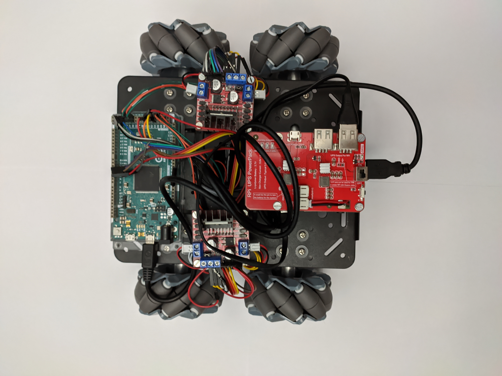
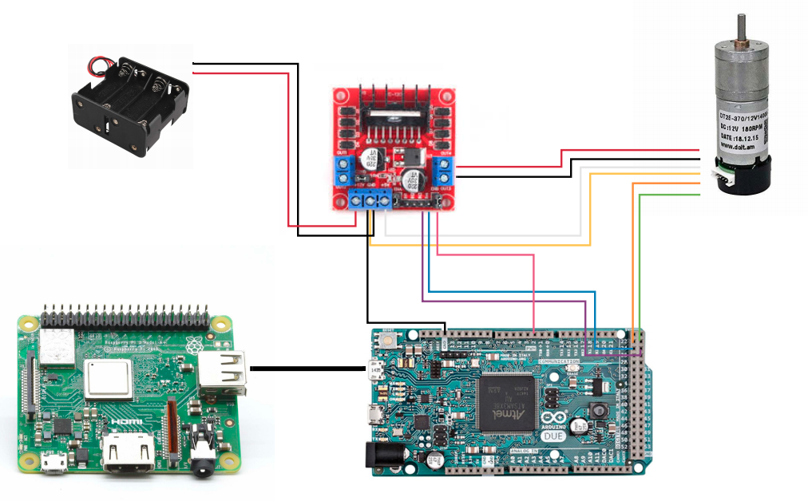
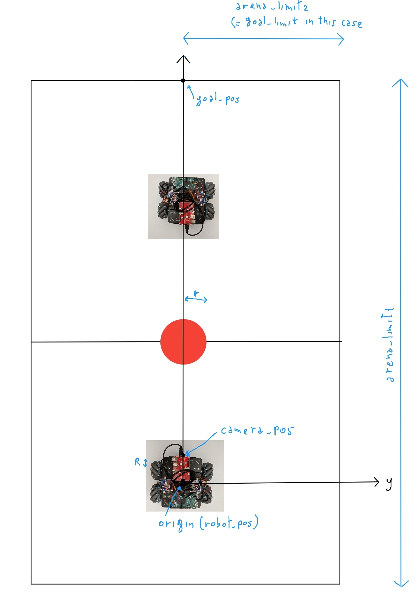

# Real Robots Play Football



## Prerequisites:

1. `Python 3`


2. `ROS`


3. `OpenCV`


4. `Robots With:`
  
  - Four Mechanum Wheels

  - Raspberry Pi with Camera Module installed
  
  - Arduino DUE
  
  - Two L298N dual H-Bridge motor Drivers
    
  - Four motors with ST XH 6 pin Connector

  - Batteries for Raspberry Pi and Drivers

5. `A Red Ball` 


## Introduction:

The main purpose of this project is to have two robots playing football inside an arena. They rely on a Raspberry Camera Module and OpenCV to recognize with the segmentation technique a red coloured ball with 20cm as diameter, and on Arduino DUE to generate PWM signals for the motors.
The position of the robot is estimated only using the encoders inside the Mechanum Wheels while the position of the ball is estimated using the knowledge of the focal length of the Camera and the dimension of the ball. 
Computer and Raspberry PI are linked using ROS and they exchange messages relying on the same Wireless network, while Raspberry PI and Arduino DUE are connected using an USB cable.
Since it was not used any Machine Learning technique or any kind of sensor to recognize other elements inside the arena, the problem of obstacle or opponent avoidance was not considered.
For better performance, some tuning values are used and they can be changed easily, check the last chapter for more informations.

## Instructions for launching the project:

  * Be sure that ROS and OpenCV are installed properly inside Raspberry Pi and Pc
  * Put the *Arduino_four_motors_driver.ino* file inside Arduino using "Arduino IDE"
  * Connect everything as in the image below 
  
  * Check that all the connections on Arduino DUE are consistent with the ones of "Arduino_four_motors_driver.ino" file
  * Put the robot in the middle of his half part of arena (the one considered has dimension of 180x120) perpendicularly with respect the opponent goal,as shown below
  
  * Be sure that Raspberry Pi and the computer are connected to the same Internet Network
  * Create a workspace (*e.g.,called "RPF"*) and put the *"RobotsPlayFootball"* package inside, then execute ```catkin_make``` in a terminal
  * In another terminal launch the ```roscore```
  * Connect to raspberry using the ssh command in a third terminal (*e.g.*, ```ssh pi@raspberryIp```)
  * Use ROS_MASTER_URI (*e.g.*, ```export ROS_MASTER_URI=http://pcIP:11311/```)
    and ROS_EXPORT_IP (*e.g.*, ```export ROS_IP=raspberryIp```) on a raspberry terminal to enable the message exchanging with the master (the Pc)
  * Install *raspicam_node* on Raspberry [link](https://github.com/UbiquityRobotics/raspicam_node).
  * Calibrate the camera [link](http://wiki.ros.org/camera_calibration) and take the resolution used and the *focal length* (in pixels) obtained
  * Change this values inside the *Ball-dedection.py* file
  * Once the Raspberry is connected, launch the *raspicam_node* using the command : ```roslaunch raspicam_node camerav2_*ResolutionUsed*.launch```
  * In the first terminal (where catkin_make was used) launch the *Ball-detection* script ```rosrun main Ball-detection.py```
  * In a fourth terminal launch the *Controller* script by using the command "rosrun main Controller.py"
  * Connect raspberry using another terminal with ssh command and use again ROS MASTER_URI and ROS_EXPORT_IP 
  * Create a simple ROS workspace in Raspberry (*e.g.,called "RPF"*) with one package called *"RobotsPlayFootball"*: inside the src folder of the main package, put the file "arduino_four_motors.py" and 		compile it using ```chmod +x``` in the terminal
  * Finally launch arduino_four_motors using the command ```rosrun main arduino_four_motors.py```

## Limits of The project:

1. As said before, the contact with any other robots or objects cannot be avoided since the camera can only recognize the red ball
2. The segmentation sometimes can recognize other objects or it can return wrong values of the ball. Pay attention!
3. The position is estimated only with odometry technique so the error will be big and the robot may be lost at some point
4. Raspberry Pi can delay the message exchanging since it is not powerful, this can create big problems with the position estimated
5. Arduino Due cannot create the exact pwm signals for the velocities computed by the controller, The robot will move in directins slightly different
6. Arduino Due take some time to put the motors at a specified speed, this enhances the error of the positons estimated
7. Some tuning values can be changed in the files to improve the performances
8. Other techniques for the position estimation and segmentation can be used to avoid some of these limits


## Tuning Values:

  - The time of the system for updating the velocities of the motors inside *Arduino_four_motors_driver.ino*

  - Dimensions of the arena, goal and the position of the camera and the goal w.r.t robot position in *Controller.Py* as shown in the image previously

  - Dimensions of the ball, the HSV values for the segmentation inside *Ball-Detection.Py* and the thresholds for the error detections

  - Focal Length and resolution of the camera inside *Ball-Detection.Py*

  - Threshold for the alignment of the angle *t2*, the threshold for position where the robot must go to push the ball *t3* and the threshold used to decie the minimum distance
	between ball and robot *t1* inside *Controller.Py*

  - Scaling Factors for the velocities and RPM computed inside *Controller.Py* and the maximum velocity the robot can go in some direction

  - The velocity of rotations must be changed directly in the conditions where it was used (alignment of angle and rotations to search the ball)

  - Delete or comment everywhere the variable *firstcheck* inside *Controller.Py* if you want to compute the position of the ball everytime the robot see that (otherwise it will
	compute its position only at the start)

  - *f* variable inside *Controller.Py* which is used to say how many times the robot must push the ball after it is aligned before going back and restart all the computations

  - The *L1*, *L2* and *R* (radius of the wheel) variables inside *Controller.Py* as shown below (notice that motors 2 and 3 are inverted in the code used) 
	
